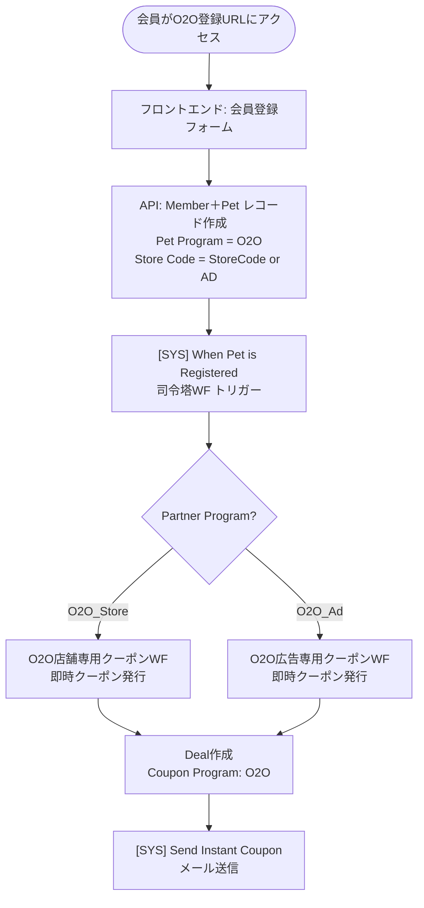

# 新規O2Oスキーマ Overview（たたき台）

> 現行メンバーポータル＋HubSpot前提。アプリ仕様確定後に再調整予定。
> 作成日: 2026-03-18

---

## 1. O2Oスキームの位置づけ

### 既存プログラム全体像

| ステータス | プログラム | 入口 | 使用場面 | 対象 | 種別 |
|---|---|---|---|---|---|
| 稼働中 | **SPKP** | QRコード | ショップ生体購入時 | 生体購入者 | 生体POE |
| 稼働中 | **BPKP** | QRコード | ブリーダー生体購入時 | 生体購入者 | 生体POE |
| **新規開発** | **O2O（店舗紐付き）** | QRコード | ショップ店頭接客時 | 他ブランド使用者 | スイッチPOE |
| **新規開発** | **O2O（店舗非紐付き）** | QRコード / デジタル広告URL | イベント・オンライン広告 | 自他ブランド使用者 | スイッチPOE |

### O2O追加の目的

PKP（SPKP/BPKP）はペット専門店市場でのシェア飽和と生体販売頭数の減少によりPOE登録頭数が横ばい。
O2Oスキームにより**ペット購入タイミング以外**での会員獲得ルートを新設し、POEの幅を拡大する。

---

## 2. O2Oの2系統

### 2.1 O2O（店舗紐付き）

| 項目 | 内容 |
|---|---|
| **ユースケース** | 店頭接客で他ブランドユーザーにスイッチを促す |
| **入口** | 各店舗専用QRコード |
| **登録URL形式** | `https://member.nutro.jp/registration/o2o?storeCode=<StoreCode>` |
| **例** | `?storeCode=TEST1`、`?storeCode=AD123` |
| **クーポン利用場所** | ショップのみ（公式通販 **除外**） ← 現行O2Oと同じ建付け |
| **クーポン発行** | 登録完了後、O2O専用ワークフローで即時発行 |

### 2.2 O2O（店舗非紐付き）

| 項目 | 内容 |
|---|---|
| **ユースケース** | イベント参加・デジタル広告経由での会員獲得 |
| **入口** | 共通QRコード / 広告ランディングURL |
| **登録URL形式** | `https://member.nutro.jp/registration/o2o?storeCode=AD` |
| **クーポン利用場所** | ショップ ＋ 公式通販（※要確認） |
| **クーポン発行** | 登録完了後、O2O専用ワークフローで即時発行 |

---

## 3. HubSpotデータ設計

### 3.1 識別フィールド（Petオブジェクト）

| プロパティ | PKP値 | O2O（店舗紐付き）値 | O2O（店舗非紐付き）値 |
|---|---|---|---|
| `Pet Program` | `PKP` | `O2O` | `O2O` |
| `Store Code Registered At` | 店舗コード | 店舗コード | `AD`（固定） |
| `Pet Registration Type` | `New` / `Existing` | `New` / `Existing`（※要確認） | `New` / `Existing`（※要確認） |
| `Partner Program` | `SPKP` / `BPKP` | `O2O_Store` | `O2O_Ad` |

> `Partner Program` で店舗紐付き／非紐付きを識別しワークフローを分岐させる案。
> 既存の `O2O` 値との整合性は要確認。

### 3.2 Contactオブジェクト（追加・変更なし）

- `Member Program` ← Petの `Pet Program` を司令塔WFで同期（既存ロジック流用）
- `Most Recent O2O Pet Number` ← 既存プロパティ流用

### 3.3 Deal（クーポン）オブジェクト

| フィールド | O2O設定値 |
|---|---|
| `Record Type` | `Coupon` |
| `Coupon Program` | `O2O` |
| `Coupon Type` | Dynamic（※要確認。現行はStaticだが変更も検討） |
| `Delivery Type` | `Instant` |
| `Coupon ID` | 7 / 8 / 9（O2O専用ID） |
| `Coupon Asset Code` | `O2O_Coupon<ID>_<PetCategory>_<StoreCode or AD>` |
| `Validity` | 要確認（PKPは365日） |

---

## 4. 登録フロー

### 4.1 ユーザー（会員）目線のフロー

```
QRコード/URL読み込み
    ↓
登録フォーム（メルアド・パスワード等 ← 簡素化の余地あり）
    ↓
登録完了 → 既存メンバーポータルにログイン
    ↓
O2O専用クーポン即時発行・メール送信
    ↓
（店舗O2O）クーポンQRコードを店頭で提示
（その他O2O）ショップ or 公式通販で使用
```

### 4.2 システム（HubSpot）目線のフロー



> **PKPとの最大の違い**: PKPは即時クーポン→14日後→月齢別の多段ワークフローだが、
> O2Oは**即時クーポンのみ**（ウェルカムジャーニーの適用範囲は要確認）。

---

## 5. PKPとO2Oの差分まとめ

| 比較軸 | SPKP / BPKP | O2O（店舗紐付き） | O2O（店舗非紐付き） |
|---|---|---|---|
| **入口** | 生体購入時のQR | 店頭接客時のQR | イベント/広告URL |
| **対象ユーザー** | 生体購入者 | 他ブランドユーザー | 自他ブランドユーザー |
| **POE種別** | 生体POE | スイッチPOE | スイッチPOE |
| **登録フォーム** | フル（ペット情報含む） | 簡素化の可能性あり | 簡素化の可能性あり |
| **即時クーポン** | あり（ID:12） | あり（O2O専用ID） | あり（O2O専用ID） |
| **14日後WJ** | あり | **要確認** | **要確認** |
| **月齢別WJ（6/8/12ヶ月）** | あり | **要確認** | **要確認** |
| **クーポン利用場所** | ショップ+公式通販 | ショップのみ | **要確認** |
| **クーポンタイプ** | Dynamic | Dynamic or Static | Dynamic or Static |
| **ブリーダー分岐** | あり（BPKP） | なし | なし |

---

## 6. 先方に確認すべきこと

### 【必須】登録フォームの簡素化範囲

> ミーティングで「O2Oだけ簡素化できるなら簡素化したい」との希望あり。

- **Q1**: 登録時に収集する情報として、何が必須で何が省略可能か？
  - PKPは `Pet Birthdate`（生年月日）が月齢別ウェルカムジャーニーのキーになるが、O2Oは月齢別WJを使わないなら不要になる
  - 例）ペット名・ペット誕生日・犬猫種別 などの要否

### 【必須】ウェルカムジャーニーの適用範囲

> PKPと同じ仕組みを流用する前提だが、O2O向けの分岐条件が未定。

- **Q2**: 14日後のウェルカムジャーニー（WJ1〜3）はO2Oにも適用するか？
- **Q3**: 月齢別ウェルカムジャーニー（生後6ヶ月・8ヶ月・12ヶ月）はO2Oにも適用するか？
  - 適用する場合は `Pet Birthdate` が必須入力になるため、フォーム簡素化と矛盾する

### 【必須】クーポン設計

- **Q4**: O2O専用クーポン（ID: 7/8/9）の内容・割引額・有効期限は？
  - 現行の停止中O2Oで使用していたアセットはそのまま使えるか、新設するか
- **Q5**: 店舗O2Oのクーポンは「発行店舗のみ」（タイプA）か、「同チェーン全店」（タイプC）か？
- **Q6**: 店舗非紐付きO2Oのクーポン利用場所は「ショップ+公式通販」でよいか？

### 【必須】`Pet Registration Type` の扱い

- **Q7**: O2Oで登録するユーザーは「他ブランドユーザー」（＝ニュートロ会員新規）を想定しているが、
  既存PKP会員が再度O2Oから登録した場合の扱いをどうするか？
  - `New` のみ対象か、`Existing` も含めてO2Oクーポンを発行するか

### 【重要】`Partner Program` の識別値

- **Q8**: 店舗紐付き／非紐付きを区別するプロパティ値をどう定義するか？
  - 案: `O2O_Store`（店舗紐付き）/ `O2O_Ad`（非紐付き）
  - 既存のO2O設定・停止中ワークフローとの整合性を確認

### ~~【確認】URLフォーマット~~（確定済み）

- **Q9**: ~~登録URLのパス構造はどちらか？~~ → **案A で確定**
  - ✅ `https://member.nutro.jp/registration/o2o?storeCode=xxx`


---

## 7. スケジュール

| マイルストーン | 期限 | 担当 |
|---|---|---|
| 現行仕様前提のO2O設計たたき台 | 2026年3月中〜4月頭 | 田中 |
| 要件書き込み・確認事項の回答 | 順次 | 木村 |
| 設計完了（未実装OK） | **2026年5月中** | 田中・木村 |

---

## 8. 未検討事項（後続フェーズ）

- アプリ移行時のO2Oスキーム移管方法
- 新アプリにおけるO2Oクーポンの表示・利用フロー
- 店舗スタッフ向けのO2O QRコード発行・管理オペレーション
- O2O経由会員のLTV測定・レポーティング設計
