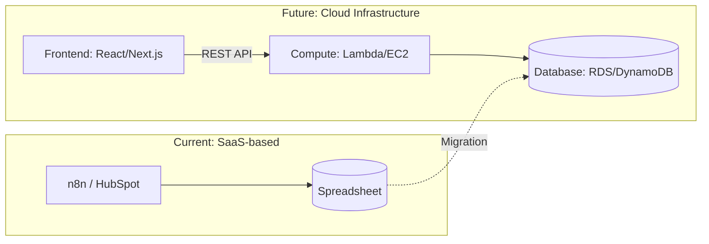
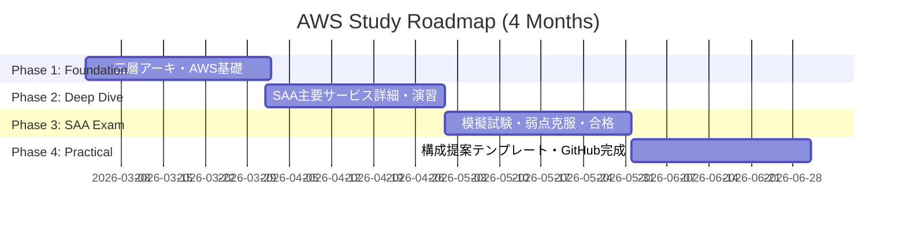

# Infrastructure Study Project (2026.03 - 2026.06)

本リポジトリは、SaaS（n8n/HubSpot）を活用したPM経験を持つ私が、
「インフラ構成をゼロから設計・提案できるITコンサル/PM」へ進化するための学習記録です。

## 1. なぜ「インフラ」を学ぶのか

### 現状の課題
* **抽象的な提案の限界:** n8nやスプレッドシートを用いた構築経験はあるが、大規模化・アプリ化の際の「インフラ構成」を具体化できていない。
* **技術選定の根拠不足:** DBの種類やサーバー構成の選択肢、それぞれのトレードオフを論理的に説明できない。

### 4ヶ月後の理想像
* **AWS SAA取得:** クラウドインフラの標準知識を体系的に習得している。
* **アーキテクチャ設計力:** 顧客の要件に対し、三層アーキテクチャに基づいた構成図（Mermaid等）を用いて一次回答ができる。

---

## 2. インフラ移行の概念イメージ

n8n+スプシの構成から、スケーラブルなWebアプリ構成への進化図です。

---

## 3. 3月第1週：スタートダッシュ計画

「インフラアレルギー」を無くし、全体像を掴むための1週間のスケジュールです。

### 使用教材

1. **Udemy:** [これだけでOK！ AWS 認定ソリューションアーキテクト – アソシエイト試験突破講座](https://www.google.com/search?q=https://www.udemy.com/share/101WM63%40O7j7_E7M_jO4Q7VfFpGv9-H1-t0j6YtF/)
2. **書籍:** 『図解即戦力 Amazon Web Servicesのしくみと技術がこれ1冊でしっかりわかる教科書』

### 日別スケジュール

| 日付 | 学習テーマ | 具体的なアクション | 清書ターゲット (GitHub/Notion) |
| --- | --- | --- | --- |
| **Day 1** | **全体俯瞰** | 書籍の第1章〜2章を読み、AWSで何ができるかを把握。 | AWSの主要サービス分類（計算、蓄積、網）の整理。 |
| **Day 2** | **箱を作る (VPC)** | UdemyのVPCセクションを視聴。ネットワークの「境界」を理解。 | VPC、サブネット、インターネットゲートウェイの図解。 |
| **Day 3** | **サーバーを立てる** | UdemyのEC2セクション。実際にインスタンスを1つ立ててみる。 | EC2の料金体系とインスタンスタイプの選び方。 |
| **Day 4** | **データを貯める** | UdemyのRDS/S3セクション。スプシとの違いを意識する。 | 構造化データ(RDS)と非構造化データ(S3)の使い分け。 |
| **Day 5** | **繋ぐ (API)** | API Gatewayの概要を調査。「n8nのWebhook」との対応を考える。 | WebリクエストがDBに届くまでのフロー図。 |
| **Day 6** | **振り返り・整理** | 今週学んだ用語を自分なりの言葉でGitHubにまとめる。 | 「スプシ脱却」の一次回答案（Ver.1）の作成。 |
| **Day 7** | **予備日/調整** | 遅れている箇所の補習、または42 Tokyoの課題。 | 次週の学習範囲の確定。 |

---

## 4. 学習の進捗管理 (Mermaid Gantt)

## 7. 隔週詳細カリキュラム & 合格基準

### Phase 1: Foundation (3月)

**【テーマ】点（SaaS）を線（三層アーキテクチャ）につなぐ**

#### **Week 1-2: ネットワークの境界線と「箱」の設計**

* **学習概念:** VPC, Subnet (Public/Private), Security Group, Route Table, Internet Gateway
* **使用書籍:** 『図解即戦力 AWSのしくみと技術』第3章 / 『インフラエンジニアの教科書』
* **理解度チェック:**
* [ ] なぜDBを「プライベートサブネット」に置く必要があるか説明できるか？
* [ ] セキュリティグループとネットワークACLの「適用範囲」の違いを言えるか？
* [ ] 自宅のPCからAWS上のサーバーに接続されるまでの経路をホワイトボードに書けるか？

#### **Week 3-4: サーバーとデータの「適材適所」**

* **学習概念:** EC2 (Instance types), Lambda (Serverless), RDS, S3, DynamoDB
* **使用書籍:** 『図解即戦力 AWSのしくみと技術』第4・5章 / 『Webを支える技術』（REST API/HTTP）
* **理解度チェック:**
* [ ] 「スプシ」と「RDS」の決定的な違い（排他制御、インデックス、容量）を3つ挙げられるか？
* [ ] 24時間動くシステムで「EC2」ではなく「Lambda」を選ぶべき基準（コスト・管理）を言えるか？
* [ ] S3を単なる「ゴミ箱」ではなく「静的ホスティング/データ湖」として使う利点を言えるか？

> **PM's Killer Phrase:** 「現在のスプシ構成ではデータ整合性に限界があります。RDSによる三層構成に移行することで、数万件のデータ処理とセキュアな権限管理を両立できます」

---

### Phase 2: Deep Dive (4月)

**【テーマ】エンタープライズ品質（非機能要件）の担保**

#### **Week 5-6: 止まらないシステム（高可用性）と負荷分散**

* **学習概念:** ELB (ALB/NLB), Auto Scaling, Route53, Multi-AZ
* **使用書籍:** 『AWS認定ソリューションアーキテクト－アソシエイト教科書（通称：黄色本）』
* **理解度チェック:**
* [ ] 「1台の高性能サーバー」より「2台の並性能サーバー」の方が優れている理由（可用性）を説明できるか？
* [ ] ヘルスチェックが失敗した際、システムがどう自動復旧するかフローを書けるか？
* [ ] ユーザーがドメインを入力してからサーバーに届くまでのRoute53の役割を言えるか？

#### **Week 7-8: セキュリティと権限の「最小特権」**

* **学習概念:** IAM (Role/Policy), AWS KMS, CloudFront (CDN), WAF
* **使用書籍:** 『AWS認定ソリューションアーキテクト－アソシエイト教科書』/ AWS公式ホワイトペーパー（Security Pillar）
* **理解度チェック:**
* [ ] IAMユーザーとIAMロールの使い分け（なぜアクセスキーを直書きしてはいけないか）を言えるか？
* [ ] CloudFront（CDN）を使うことで、なぜサーバーの負荷が下がり、表示速度が上がるのか説明できるか？
* [ ] 外部からの攻撃（SQLインジェクション等）をどこで防ぐべきか（WAFの配置）を知っているか？

---

### Phase 3: SAA Exam (5月)

**【テーマ】「最適解」を選ぶ判断基準の確立**

#### **Week 9-10: コスト最適化とパフォーマンス効率**

* **学習概念:** S3 Storage Classes, Reserved Instances/Savings Plans, CloudWatch
* **使用教材:** Udemy模擬試験 / 『AWS認定資格試験テキスト SAA-C03』
* **理解度チェック:**
* [ ] 1年以上動かすことが確定しているシステムで、コストを30%以上削減する提案ができるか？
* [ ] 滅多にアクセスしない過去ログを、最も安価に保存するストレージクラスを選択できるか？

#### **Week 11-12: 実戦模擬演習と試験合格**

* **学習概念:** 試験全範囲の総復習
* **使用教材:** AWS公式問題集 / TechStock（旧称：こいぬ）
* **理解度チェック:**
* [ ] 模擬試験で初見の問題に対し、80%以上の正解率を出せるか？
* [ ] **目標：5月末までにAWS SAA合格証を取得する。**

---

### Phase 4: Practical (6月)

**【テーマ】コンサルタントとしての武器（ポートフォリオ）化**

#### **Week 13-14: モダン開発への対応（コンテナ・認証）**

* **学習概念:** Docker, ECS/Fargate, Cognito, OAuth2.0
* **使用書籍:** 『プロフェッショナルWebエンジニアのためのDocker入門』/ 『徹底攻略AWS認定SysOpsアドミニストレーター』
* **理解度チェック:**
* [ ] 「サーバーを立てる」のと「コンテナを動かす」の運用上の違い（環境の再現性）を言えるか？
* [ ] 自社開発アプリに「Googleログイン」を実装する際、AWSのどのサービスを使うべきか即答できるか？

#### **Week 15-16: アーキテクチャ提案の完成**

* **学習概念:** マイグレーション戦略、TCO（総保有コスト）計算
* **アウトプット:** GitHubに「n8n構成 → AWS標準構成」への移行提案書（.md）を完成させる
* **理解度チェック:**
* [ ] 顧客に対し、導入費用だけでなく「運用コスト（人件費・保守）」を含めた比較提案ができるか？
* [ ] GitHubの `infrastructure_study` が、自分の「インフラ理解の証明書」として人に見せられる状態か？

