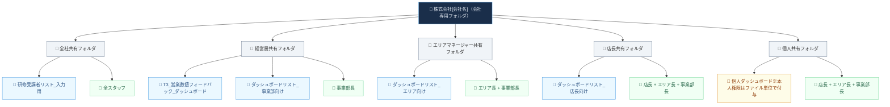

# フォルダ・権限構造図

```mermaid
graph TD
    ROOT["📁 株式会社[会社名]（会社専用フォルダ）"]

    ROOT --> ZENSHA["📁 全社共有フォルダ"]
    ROOT --> KEIEI["📁 経営層共有フォルダ"]
    ROOT --> AREA["📁 エリアマネージャー共有フォルダ"]
    ROOT --> TENCHO["📁 店長共有フォルダ"]
    ROOT --> KOJIN["📁 個人共有フォルダ"]

    ZENSHA --> F1["📄 研修受講者リスト_入力用"]
    ZENSHA --> P_Z["👥 全スタッフ"]

    KEIEI --> F2["📄 T3_営業数値フィードバック_ダッシュボード"]
    KEIEI --> F3["📄 ダッシュボードリスト_事業部向け"]
    KEIEI --> P_K["👤 事業部長"]

    AREA --> F4["📄 ダッシュボードリスト_エリア向け"]
    AREA --> P_A["👤 エリア長 + 事業部長"]

    TENCHO --> F5["📄 ダッシュボードリスト_店長向け"]
    TENCHO --> P_T["👤 店長 + エリア長 + 事業部長"]

    KOJIN --> F6["📄 個人ダッシュボード※本人権限はファイル単位で付与"]
    KOJIN --> P_KJ["👤 店長 + エリア長 + 事業部長"]

    style ROOT fill:#1a2e4a,color:#e2e8f0,stroke:#63b3ed
    style ZENSHA fill:#f0f4f8,stroke:#718096
    style KEIEI fill:#f0f4f8,stroke:#718096
    style AREA fill:#f0f4f8,stroke:#718096
    style TENCHO fill:#f0f4f8,stroke:#718096
    style KOJIN fill:#f0f4f8,stroke:#718096
    style F1 fill:#ebf8ff,stroke:#4299e1,color:#2c5282
    style F2 fill:#ebf8ff,stroke:#4299e1,color:#2c5282
    style F3 fill:#ebf8ff,stroke:#4299e1,color:#2c5282
    style F4 fill:#ebf8ff,stroke:#4299e1,color:#2c5282
    style F5 fill:#ebf8ff,stroke:#4299e1,color:#2c5282
    style F6 fill:#fefce8,stroke:#d97706,color:#92400e
    style P_Z fill:#f0fff4,stroke:#68d391,color:#276749
    style P_K fill:#f0fff4,stroke:#68d391,color:#276749
    style P_A fill:#f0fff4,stroke:#68d391,color:#276749
    style P_T fill:#f0fff4,stroke:#68d391,color:#276749
    style P_KJ fill:#f0fff4,stroke:#68d391,color:#276749
```
