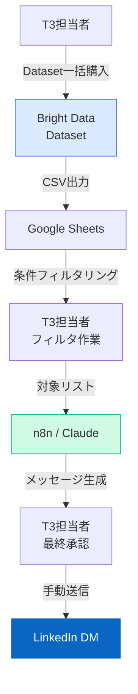
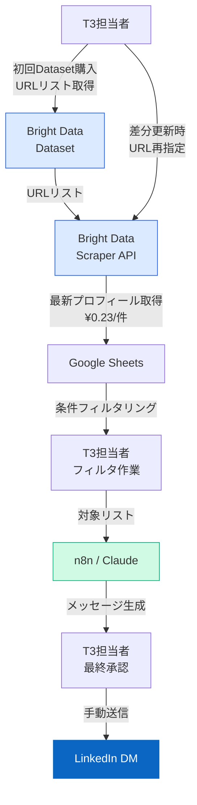
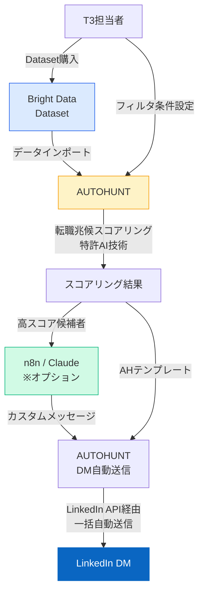
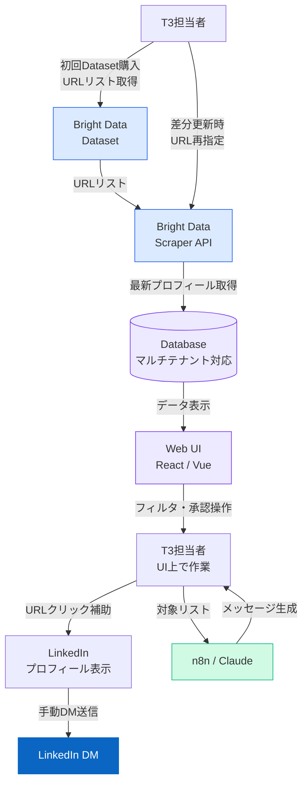
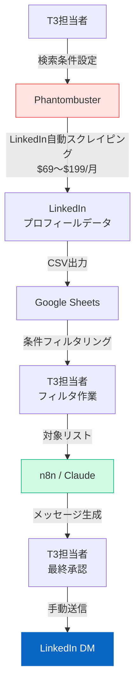
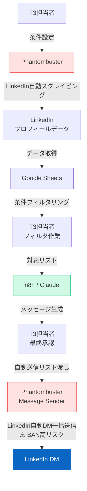

# LinkedIn追加機能 実装パターン比較（A〜F）

## パターンA〜Fのアーキテクチャ図

---

## パターンA — BD / Dataset のみ

**一括購入・買い切り（差分更新なし）**

DatasetをCSVで一括購入してスプシに投入。更新は都度T3担当者が再購入して差し替えるシンプルな構成。

**費用感**
- 開発費：80〜120万円
- 月額ランニング：〜2万円（API費のみ）
- 初回Dataset購入：数十〜200万円（別途）

---

## パターンB — BD / Dataset + Scraper API

**初回購入 ＋ 差分更新あり（URL指定で最新情報取得）**

DatasetでURLリストを取得後、Scraper APIに対象URLを渡して最新プロフィール情報を随時取得。転職・情報更新を検知できる。

**費用感**
- 開発費：100〜150万円
- 月額ランニング：2〜4万円（Scraper API ¥0.23/件 + API費）
- 初回Dataset購入：別途

---

## パターンC — BD + AUTOHUNT 連携

**BDデータ × AUTOHUNTで転職潜在層にDM送信**

BDで取得したデータをAUTOHUNTにインポート。転職兆候スコアリングとLinkedIn一括DM送信機能を活用。

**費用感**
- 開発費：50〜80万円
- 月額ランニング：AUTOHUNT月額 + API費（AH料金要確認）
- 初回Dataset購入：別途

---

## パターンD — BD / Dataset + Scraper API + フロント

**差分更新あり ＋ 専用UI（マルチテナント対応）**

BパターンにWebフロント画面を追加。候補者一覧・フィルタ・URLワンクリック補助を実装。複数クライアント展開向け。

**費用感**
- 開発費：200〜280万円（パターンB + UI開発 80〜130万円）
- 月額ランニング：2〜4万円（Scraper API + API費）
- 初回Dataset購入：別途
- 移行推奨：マルチテナント展開確定後にB→D

---

## パターンE — Phantombuster / スクレイピングのみ

**PBでデータ収集・メッセージ生成（DM送信は人力）**

PB LinkedIn Profile ScraperでデータをCSV取得後、n8nでメッセージ生成。初期Dataset購入費なしで始められる。

> ⚠️ **リスク注意**：LinkedInのToSグレーゾーン。レート制限遵守により実運用上のBANリスクは管理可能。

**費用感**
- 開発費：80〜120万円
- 月額ランニング：2〜5万円（PB $69〜$199/月 + API費）
- 初期Dataset購入：不要（コスト優位）

---

## パターンF — Phantombuster / DM自動送信（PoC）

**PBでDM自動送信まで試験的に実施（BAN・ToSリスクあり）**

Phantombuster Message Senderで自動DM送信を試験的に実施。LinkedInアカウントへの影響が大きく、**商用本番での継続利用は非推奨**。

> 🚨 **HIGH RISK**：LinkedIn ToS違反。週100件超でアカウント停止リスク大。T3メインアカウントでの本番利用は不可。PoC・検証用途限定。

**費用感**
- 開発費：130〜180万円
- 月額ランニング：5〜10万円
- 初期Dataset購入：不要

---

## パターン比較サマリー

| | A | B | C | D | E | F |
|---|:---:|:---:|:---:|:---:|:---:|:---:|
| データソース | BD Dataset | BD Dataset + Scraper | BD + AUTOHUNT | BD Dataset + Scraper | Phantombuster | Phantombuster |
| 差分更新 | ✗ | ✓ | ✓ | ✓ | ✓ | ✓ |
| DM送信 | 手動 | 手動 | 自動（AH） | 手動 | 手動 | 自動（PB）⚠️ |
| 専用UI | ✗ | ✗ | AH UI | ✓ Web UI | ✗ | ✗ |
| 初期Dataset費 | 要 | 要 | 要 | 要 | 不要 | 不要 |
| 開発費 | 80〜120万 | 100〜150万 | 50〜80万 | 200〜280万 | 80〜120万 | 130〜180万 |
| 月額ランニング | 〜2万 | 2〜4万 | AH月額+ | 2〜4万 | 2〜5万 | 5〜10万 |
| リスク | 低 | 低 | 低〜中 | 低 | 中 | 高 |
