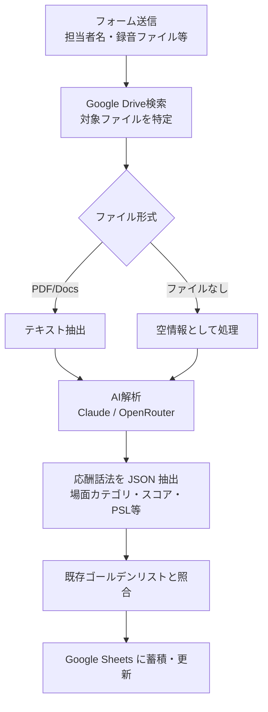
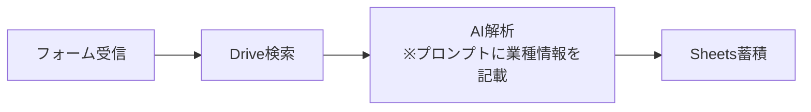
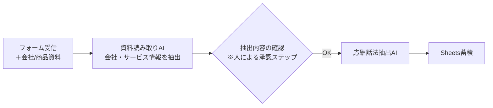
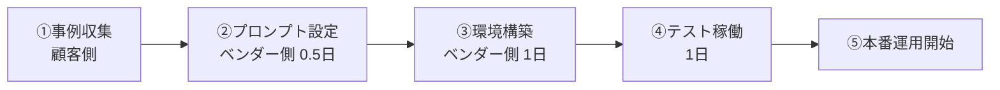

# 応酬話法AIエージェント 単体販売 提案書

---

## エグゼクティブサマリー

本提案は、現行の営業フィードバックシステムから **「応酬話法自動抽出・蓄積機能」** を切り出し、業種・商品を問わず使えるスタンドアロン製品として提供するものです。

営業録音・商談記録をAIが解析し、優秀な営業担当者が使った **切り返しトーク（応酬話法）を自動でスコアリング・分類・蓄積** します。蓄積されたゴールデンデータは、新人教育・ロールプレイ設計・マニュアル作成に即活用できます。

導入形態は2パターン。初期展開には **パターンA（低工数・即時導入）を推奨** します。

---

## 背景と課題

### なぜ今このシステムが必要か

| 課題 | 内容 |
|------|------|
| 属人化 | 優秀な営業マンのトークが個人に留まり、組織に蓄積されない |
| 分析コスト | 商談録音の文字起こし・分析を人手でやるには時間とスキルが必要 |
| 標準化の難しさ | 「何が良いトークか」の基準が曖昧なまま研修が設計される |
| 業種横断の課題 | 中古車販売以外の営業現場でも同様の課題が存在する |

### 解決したいこと

- 商談録音・議事録から **良いトーク・切り返しを自動抽出**
- スコアリングとフレームワーク分類（PSL、30-50-60レベル）で **質を見える化**
- 組織の応酬話法ゴールデンデータとして **自動蓄積・更新**

### 前提条件（重要）

> **「どういったトークが良いトークか」という正解情報のインプットが必要。**
> AIは商談内容を分析しスコアを付けるが、何を「良い」とするかの基準は人間側が設定する必要があります。

---

## 現行システムの仕組み



### AIが抽出・分析する項目

| 項目 | 内容 |
|------|------|
| 場面カテゴリ | 商談のどの場面か（アプローチ・ヒアリング・クロージングなど） |
| 顧客の発言（ネガティブ） | 断り文句・懸念・反論など |
| 応酬話法 | 営業側の切り返しトーク（口語 → プロスクリプトに整形） |
| スコア（1〜10） | 成約への影響・ニーズ引き出し・信頼獲得を軸に数値化 |
| PSLフレームワーク | Logic / Soul / Process タグ分類 |
| PSL3軸評価 | 各軸の定性コメント |
| 30-50-60レベル | 営業力レベル分類（Lv.1〜Lv.3） |
| 改善ポイント | 次回商談に向けた具体的アドバイス |

---

## 導入パターン比較

### パターンA：プロンプト編集型（現行フローを流用）

**概要：** 現行ワークフローのAIプロンプトに、対象業種・商品・サービスの情報を埋め込んで使う。



**メリット**
- 設計変更が最小限、即時導入可能
- 運用・保守コストが低い
- 効果検証しながら段階的に改善できる

**デメリット**
- プロンプト変更は手動作業（設定担当者が必要）
- 複数商材・業種に同時対応する場合、プロンプト管理が煩雑になる

---

### パターンB：AI資料読み取り型（新規設計）

**概要：** 会社概要資料・サービス資料を読み取る専用AIを追加し、その情報をもとに応酬話法抽出の文脈を自動設定する。



**メリット**
- 資料を更新するだけでAIの文脈が変わる（設定変更不要）
- 多業種・多商材への拡張性が高い

**デメリット**
- 設計・実装に大きな工数が必要
- **会社情報の抽出精度を人が確認する承認ステップが必要**（精度保証が難しい）
- 資料の品質に依存するため、資料が不十分だと抽出精度が下がる

---

## 論点整理

### 論点1：パターンAで十分か？

**結論：初期展開はパターンAで十分。**

- 応酬話法の質を左右するのは「プロンプトに何を書くか」であり、これは業種・商品に詳しい担当者が設定するのが最も精度が高い
- パターンBで自動化しても、AIが資料から抽出した「文脈」が正しいかの確認コストが発生する → 結局人が確認することになる
- まずパターンAで運用し、「プロンプト管理の煩雑さ」が現実の課題として顕在化してからパターンBを検討するのが合理的

### 論点2：パターンBは本当に自動化できるか？

**品質保証の問題が残る。**

- 会社概要資料 → AI抽出 → 応酬話法判定に使う、という流れでは、**中間の「会社情報抽出」が正しいかを確認する工程が必要**
- 承認ステップをなくせない場合、「自動化」のメリットが薄れる
- パターンBは「将来ロードマップ」として設計・見積もりのみ提示し、実装は顧客の課題が明確化してから着手することを推奨

---

## 工数感

### パターンA（プロンプト編集型）

| 作業 | 工数 |
|------|------|
| 対象業種・商品のプロンプトカスタマイズ | 0.5日 |
| Google Sheets / Drive 接続設定 | 1日 |
| テスト・品質調整 | 1〜2日 |
| **合計** | **約2〜3日** |

> ※ 顧客側で「良いトーク事例」を事前に準備いただく必要があります（ゴールデンデータの初期セット）

### パターンB（AI資料読み取り型）

| 作業 | 工数 |
|------|------|
| 要件定義・設計 | 1週間 |
| 資料読み取りAI実装（RAG / 構造化抽出） | 2週間 |
| 抽出精度検証・改善ループ | 1〜2週間 |
| 承認ステップUI / フロー設計 | 1週間 |
| 結合テスト・本番環境構築 | 1週間 |
| **合計** | **約6〜7週間** |

> ※ 資料の品質・構造によって精度が変わるため、検証フェーズを省くことはリスクになります

---

## 推奨案

```
パターンA（約2〜3日）で即時リリース
　↓
実運用の中で「プロンプト管理の手間」が課題化した時点で
　↓
パターンB（約6〜7週間）への移行を検討
```

**理由**
1. コストと効果のバランスが最良
2. AIに任せるよりも、業種知識を持つ人がプロンプトを設定した方が初期精度が高い
3. パターンBの品質保証問題は、運用データが蓄積されてから設計した方が現実的な解が見つかる

---

## 導入ステップ（パターンA）



| ステップ | 担当 | 内容 |
|----------|------|------|
| ① 事例収集 | 顧客 | 対象業種での「良いトーク例」を10〜30件程度用意（録音・議事録・手書きメモ可） |
| ② プロンプト設定 | ベンダー | 業種・商品・判定基準をプロンプトとゴールデンデータリストに設定 |
| ③ 環境構築 | ベンダー | n8n・Google Workspace の接続設定、フォームの準備 |
| ④ テスト稼働 | 両者 | 実際の録音・議事録で動作確認・精度調整 |
| ⑤ 本番運用 | 顧客 | フォームに録音データをアップするだけで自動蓄積 |
