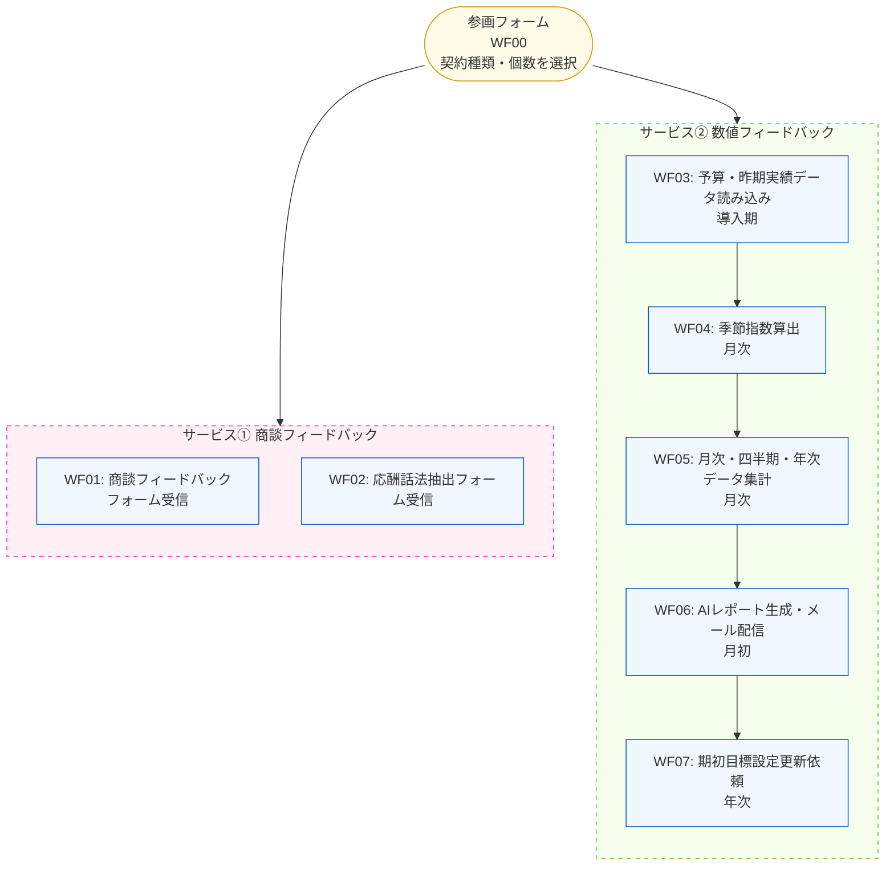
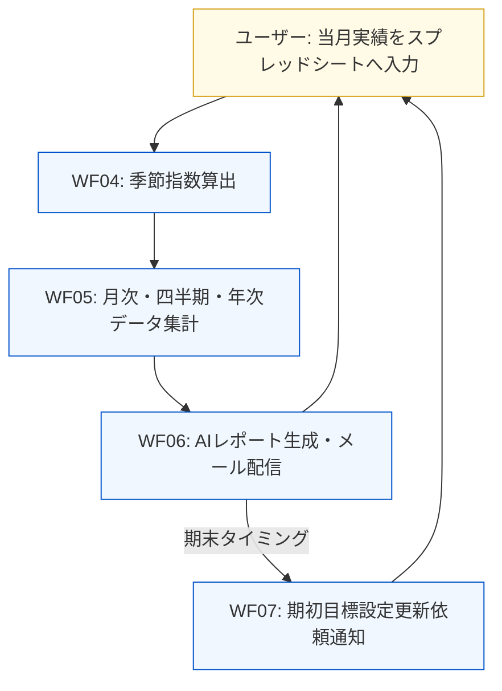

# 自動セールスフィードバックシステム概要

## システム全体像

参画フォームで**契約種類・個数を選択**することで、以下2つのサービスが自動で提供されるシステム。

---

## サービス①：商談フィードバック

### WF01 商談フィードバックフォーム受信
- 商談ごとのフィードバックフォームを受信・記録
- Googleスプレッドシートへデータを格納

### WF02 応酬話法抽出フォーム受信
- 商談中の応酬話法（営業トーク）をフォームから収集
- AIを活用してパターンを抽出・蓄積

---

## サービス②：数値フィードバック

### 【導入期】初期セットアップ (WF03)

| フェーズ | 対応者 | 内容 |
|---|---|---|
| 1 | ユーザー | 初期設定フォームに回答（会社情報・組織構成） |
| 2 | システム | 組織別シート・フォルダを自動生成 |
| 3 | ユーザー | スプレッドシートへ予算・昨期実績を入力 |

### 【運用期】月次サイクル (WF04–WF06)

毎月月末に自動起動するサイクル：

#### WF04 季節指数算出
- 毎月末に自動実行
- 会社情報マスタをもとに、KPIの季節変動係数を算出
- 事業年度開始月を考慮した条件分岐あり

#### WF05 月次・四半期・年次データ集計
- 毎月末に自動実行
- 月次・四半期・半期・年次の単位でKPIを集計・分類
- 対象KPI：来店数、アンケート、見積、成約など

#### WF06 フィードバックレポート生成・配信
- 毎月1日 1:00 に自動実行
- Claude AI（Sonnet）でレポートを自動生成
- 会社・エリア・店舗ごとにメールで配信

**AIレポートの出力項目（6項目）：**

| # | 項目名 | 内容 |
|---|---|---|
| 1 | 今月の称賛 | 今月の成果への肯定的フィードバック |
| 2 | 一言総括 | 今月全体のサマリー |
| 3 | 来月の優先テーマ | 次月に注力すべきテーマ |
| 4 | 来月の行動目標 | 具体的なアクションプラン |
| 5 | 店長自身の行動KPI | 店長個人のKPI提示 |
| 6 | 年間達成に向けたコメント | 年間目標に対する進捗コメント |

### 【更新期】次年度準備 (WF07)

- 事業年度終了タイミングで自動実行
- 来年度の目標設定更新をメールで通知
- 通知後、新年度の月次サイクルへ移行

---

## 使用技術・インフラ

| 区分 | 内容 |
|---|---|
| ワークフロー基盤 | n8n |
| データストア | Google スプレッドシート / Google ドライブ |
| 通知 | Gmail |
| AI生成 | Claude Sonnet（Anthropic API） |
| カスタム処理 | Google Apps Script |

### 主要マスタスプレッドシート

| スプレッドシート名 | 用途 |
|---|---|
| 会社情報管理マスタ | 会社・エリア・店舗・担当者情報 |
| 組織体制管理マスタ | 組織階層・担当者構成 |
| 昨期実績管理マスタ | 前年度KPI実績 |
| 予算情報管理マスタ | 当年度予算 |
| 月次ローデータ_合算後 | 月次集計済みKPIデータ |

---

## ワークフロー一覧

| WF番号 | ファイル名 | トリガー | 概要 |
|---|---|---|---|
| WF00 | 研修参画フォームの受信 | フォーム送信 | 参画フォーム受信・初期設定 |
| WF01 | 商談フィードバックの受信 | フォーム送信 | 商談フィードバック収集 |
| WF02 | 応酬話法抽出フォームの受信 | フォーム送信 | 応酬話法データ収集 |
| WF03 | 予算・昨期実績情報読み込み | 月末スケジュール | 導入期データ準備 |
| WF04 | 季節指数算出ワークフロー | 月末スケジュール | 季節変動係数の算出 |
| WF05 | 月次_四半期_年次 数値集計・分類 | 月末スケジュール | 期間別KPI集計 |
| WF06 | フィードバックレポート生成・配信 | 月初（1日 1:00） | AIレポート生成・メール配信 |
| WF07 | 期初目標設定更新依頼 | 月次スケジュール | 年度更新の通知メール |
| ― | マスタ平均算出 | 手動 | KPI平均値の手動計算 |
| ― | 数値レポートテスト | 手動 | レポート生成のテスト用 |
