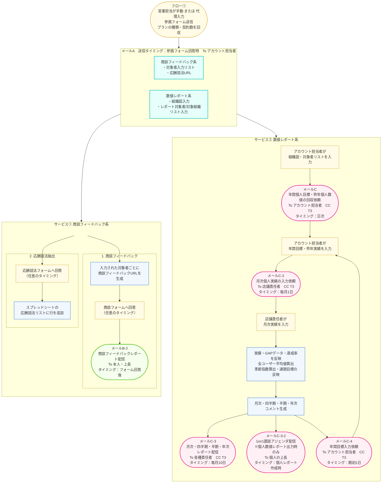

# 営業フィードバックAIエージェント 初期登録フロー



---

## メール一覧

| メール名 | メールで通知する内容 | 宛先 | タイミング |
|---|---|---|---|
| メールA | ①商談FB系：対象者入力リスト・応酬話法URL<br>②数値レポート系：組織図入力・レポート対象者リスト入力 | アカウント担当者 | 参画フォーム回答時 |
| メールB | 商談フィードバックレポート | 本人 / 上長 | 商談フォーム回答後・フィードバック生成完了時 |
| メールC | 年間個人目標の回収依頼、昨年個人数値の回収依頼 | アカウント担当者（CC: T3） | 日次 |
| メールC-2 | 月次個人実績の入力依頼 | 店舗責任者（CC: T3） | 毎月1日 |
| メールC-3 | 月次・四半期・半期・年次レポート完成通知 | 各種責任者（CC: T3） | 毎月10日 |
| メールC-3-2 | 1on1面談アジェンダ配信（個人数値レポート出力時のみ） | 個人の上長 | 個人レポート作成時（毎月10日前後） |
| メールC-4 | 年間目標入力依頼 | アカウント担当者（CC: T3） | 期初1日 |

---

## メール文面

### メールA｜初期設定依頼（参画フォーム回答後）

**件名：** 【営業フィードバックAIエージェント】初期設定のご依頼｜{{会社名}}

**本文：**
```
{{担当者名}} 様

このたびは営業フィードバックAIエージェントにご参画いただきありがとうございます。
サービスを開始するにあたり、以下2点の初期設定をご対応いただけますでしょうか。

━━━━━━━━━━━━━━━━━━━━━━
① 商談フィードバック系：対象者・応酬話法の登録
━━━━━━━━━━━━━━━━━━━━━━
下記スプレッドシートに、商談フィードバックの対象者情報および応酬話法URLをご入力ください。

▼ 対象者入力リスト
{{スプレッドシートURL_商談}}

▼ 応酬話法入力シート
{{スプレッドシートURL_応酬話法}}

━━━━━━━━━━━━━━━━━━━━━━
② 数値レポート系：組織図・対象者/対象組織の登録
━━━━━━━━━━━━━━━━━━━━━━
下記スプレッドシートに、組織図（エリア・店舗・担当者）およびレポート対象者・対象組織をご入力ください。

▼ 組織図・対象者入力シート
{{スプレッドシートURL_組織図}}

ご不明な点がございましたら、お気軽にご連絡ください。
どうぞよろしくお願いいたします。

T3株式会社
```

---

### メールB-2｜商談フィードバックレポート配信

**件名：** 【商談フィードバック】{{氏名}}さんの商談レポートが届きました｜{{日付}}

**本文：**
```
{{氏名}} 様
（CC：{{上長名}} 様）

商談フォームのご回答ありがとうございます。
AIによるフィードバックレポートが生成されましたのでお送りします。

━━━━━━━━━━━━━━━━━━━━━━
商談フィードバックレポート
━━━━━━━━━━━━━━━━━━━━━━
{{AIフィードバックレポート本文（HTML）}}

━━━━━━━━━━━━━━━━━━━━━━
次回の商談でもフォームからご回答いただけると、継続的な改善につながります。
引き続きよろしくお願いいたします。

T3株式会社
```

---

### メールC｜年間目標・昨年実績の入力依頼

**件名：** 【営業フィードバックAIエージェント】年間目標・昨年実績のご入力依頼｜{{会社名}}

**本文：**
```
{{担当者名}} 様

お世話になっております。
数値フィードバックサービスを開始するにあたり、下記2点のご入力をお願いいたします。

━━━━━━━━━━━━━━━━━━━━━━
① 昨年の個人実績データ（初回のみ）
━━━━━━━━━━━━━━━━━━━━━━
対象期間：{{昨年度期間（例：2024年4月〜2025年3月）}}
入力項目：6KPI × 従業員人数 × 12ヶ月

▼ 昨年実績入力シート
{{スプレッドシートURL_昨年実績}}

━━━━━━━━━━━━━━━━━━━━━━
② 今年度の個人目標
━━━━━━━━━━━━━━━━━━━━━━
対象期間：{{今年度期間（例：2025年4月〜2026年3月）}}
入力項目：6KPI × 営業人数 × 12ヶ月

▼ 年間目標入力シート
{{スプレッドシートURL_年間目標}}

入力が完了しましたら、翌月からレポートの自動配信が開始されます。
ご不明点はお気軽にご連絡ください。

T3株式会社
```

---

### メールC-2｜月次実績の入力依頼

**件名：** 【月次実績入力のお願い】{{年月}}の実績をご入力ください｜{{会社名}} {{店舗名}}

**本文：**
```
{{店舗責任者名}} 様

お疲れさまです。
{{年月}}の月次実績入力のお時間です。下記シートへのご入力をお願いいたします。

▼ 月次実績入力シート
{{スプレッドシートURL_月次実績}}

入力項目：6KPI × 営業人数
入力期限：{{年月}} {{日}}日（月初）

入力が完了すると、{{月次レポート配信予定日（例：10日）}}頃にフィードバックレポートをお送りします。

どうぞよろしくお願いいたします。

T3株式会社
（CC：T3担当者）
```

---

### メールC-3｜月次・四半期・半期・年次レポート配信

**件名：** 【{{期間種別}}レポート】{{会社名}} {{組織名}} ｜{{年月}}

**本文：**
```
{{責任者名}} 様

{{年月}}の{{期間種別}}フィードバックレポートをお送りします。

━━━━━━━━━━━━━━━━━━━━━━
{{期間種別}}フィードバックレポート
対象：{{会社名}} / {{エリア名}} / {{店舗名}}
━━━━━━━━━━━━━━━━━━━━━━

【今月の称賛】
{{今月の称賛コメント}}

【一言総括】
{{一言総括コメント}}

【来月の優先テーマ】
{{来月の優先テーマ}}

【来月の行動目標】
{{来月の行動目標}}

【店長自身の行動KPI】
{{店長行動KPI}}

【年間達成に向けたコメント】
{{年間達成コメント}}

━━━━━━━━━━━━━━━━━━━━━━
▼ 詳細ダッシュボードはこちら
{{ダッシュボードURL}}

引き続きよろしくお願いいたします。

T3株式会社
（CC：T3担当者）
```

---

### メールC-3-2｜1on1面談アジェンダ配信（個人レポート時のみ）

**件名：** 【1on1面談アジェンダ】{{氏名}}さんとの面談準備｜{{年月}}

**本文：**
```
{{上長名}} 様

{{年月}}の個人フィードバックレポートが生成されました。
下記に{{氏名}}さんとの1on1面談アジェンダをご用意しましたので、ご活用ください。

━━━━━━━━━━━━━━━━━━━━━━
1on1面談アジェンダ｜{{氏名}}（{{店舗名}}）
対象月：{{年月}}
━━━━━━━━━━━━━━━━━━━━━━

【1. 今月の振り返り（5分）】
・目標に対する達成率：{{達成率}}%
・特に良かった点：{{今月の称賛コメント}}

【2. 数字の確認（10分）】
・{{KPI項目①}}：目標 {{目標値}} ／ 実績 {{実績値}}（差：{{差異値}}）
・{{KPI項目②}}：目標 {{目標値}} ／ 実績 {{実績値}}（差：{{差異値}}）
・{{KPI項目③}}：目標 {{目標値}} ／ 実績 {{実績値}}（差：{{差異値}}）

【3. 来月のアクション確認（10分）】
・優先テーマ：{{来月の優先テーマ}}
・行動目標：{{来月の行動目標}}
・本人KPI：{{店長行動KPI}}

【4. 年間進捗の確認（5分）】
{{年間達成コメント}}

━━━━━━━━━━━━━━━━━━━━━━
▼ 個人詳細レポートはこちら
{{個人ダッシュボードURL}}

面談の実施後、ご不明点等ございましたらご連絡ください。

T3株式会社
```

---

### メールC-4｜年間目標入力依頼（期初）

**件名：** 【年間目標更新のお願い】新年度の目標入力をお願いします｜{{会社名}}

**本文：**
```
{{担当者名}} 様

お世話になっております。
新年度（{{新年度期間（例：2026年4月〜2027年3月）}}）の開始にあたり、年間目標の更新をお願いいたします。

▼ 年間目標入力シート
{{スプレッドシートURL_年間目標}}

入力項目：6KPI × 営業人数 × 12ヶ月
入力期限：{{期初入力期限}}

※ 入力完了後、翌月分から新年度の目標をもとにしたフィードバックレポートが配信されます。

昨年度の実績をもとに算出した参考値も入力シート内に記載しておりますので、
目標設定の参考としてご活用ください。

どうぞよろしくお願いいたします。

T3株式会社
（CC：T3担当者）
```
