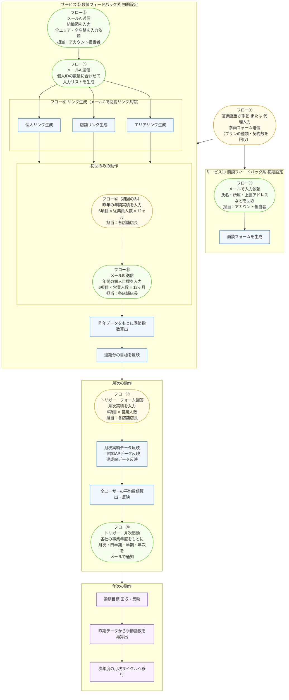

# 営業フィードバックAIエージェント 初期登録フロー

---

## フロー番号サマリー

| フロー | サービス | トリガー | 担当 | 内容 |
|---|---|---|---|---|
| ① | 共通 | 営業担当（手動） | 営業担当 / アカウント担当 | 参画フォーム送信。プランの種類・契約数を回収 |
| ③ | 商談FB系 | フロー①の完了 | アカウント担当者 | メールで氏名・所属・上長アドレスなどを回収し商談フォームを生成 |
| ② | 数値FB系 | フロー①の完了 | アカウント担当者 | メールAで組織図入力依頼。全エリア・全店舗を登録 |
| ⑤ | 数値FB系 | フロー②の完了 | システム | 個人IDの数量に合わせて入力リストを自動生成 |
| ⑥（リンク共有） | 数値FB系 | フロー⑤の完了 | システム | メールCで個人/店舗/エリアの閲覧リンクを生成・共有 |
| ⑥（初回のみ） | 数値FB系 | フロー⑤の完了 | 各店舗店長 | 昨年年間実績を入力（6項目×従業員人数×12ヶ月）|
| ⑥（目標入力） | 数値FB系 | フロー⑤の完了 | 各店舗店長 | メールBで年間個人目標を入力（6項目×営業人数×12ヶ月） |
| ⑦ | 数値FB系 | フォーム回答 | 各店舗店長 | 月次実績を入力（6項目×営業人数） |
| ⑧ | 数値FB系 | 月次起動 | システム | 各社の事業年度をもとに月次・四半期・半期・年次でメール通知 |
