# AI精度レビュー — 論点整理・修正案

> 対象: Agent 2 (カシワ).json  
> 目的: プロンプト改善ポイントの洗い出しと具体的修正案の提示

---

## 全体フロー（問題箇所マッピング）

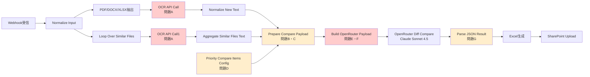

---

## 論点一覧

| # | 場所 | 問題 | 修正案 | 優先度 |
|---|---|---|---|---|
| A | OCR API Call | OCRプロンプトが薄く表・段組みが崩れる | あり（後述） | 🔴 高 |
| B | Prepare Compare Payload | テキスト70,000文字カットが無通知 | あり（後述） | 🔴 高 |
| C | Prepare Compare Payload | 候補ファイルの選定根拠が見えない | 一部あり | 🟡 中 |
| D | Priority Compare Items Config | 部署不明時のデフォルトが危険 | あり（後述） | 🟡 中 |
| E | Build OpenRouter Payload | before/after逆転の検証手段がない | あり（後述） | 🔴 高 |
| F | Build OpenRouter Payload | システムプロンプトが長すぎる・構造不明 | あり（後述） | 🟡 中 |
| G | Parse JSON Result | 欠損セクションで全ワークフロー停止 | 方針確認要 | 🟡 中 |
| H | 全体 | 精度を測る仕組みがない | 設計提案あり | 🔴 高 |

---

## 問題A：OCRプロンプトが薄い

### 現状

```json
{
  "role": "user",
  "content": [
    { "type": "text", "text": "OCRして抽出テキストだけ返してください。" },
    { "type": "file", "file": { "filename": "document.pdf", "file_data": "..." } }
  ]
}
```

### リスク

船舶仕様書には複雑なレイアウトが多い。指示がないと以下の問題が起きる。

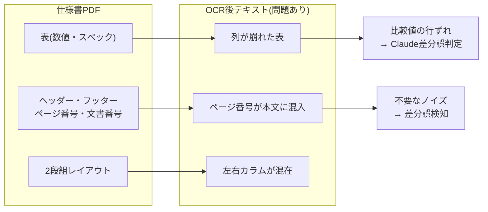

### 修正案

```json
{
  "role": "user",
  "content": [
    {
      "type": "text",
      "text": "このPDFを正確にOCRしてください。\n\n【出力ルール】\n- 表はヘッダー行と値行をそのまま再現し、列は半角スペースまたはタブで揃えてください\n- ページ番号・文書番号・改訂履歴などのヘッダー・フッターは除外してください\n- セクション見出しは元のレベル構造を維持してください（例: 1. / 1.1 / 1.1.1）\n- 図・画像内のテキストのみ抽出し、図自体の説明は不要です\n- 抽出テキストのみを返し、コメント・説明文は一切不要です"
    },
    {
      "type": "file",
      "file": { "filename": "document.pdf", "file_data": "..." }
    }
  ]
}
```

### 確認事項

- [ ] 実際のOCR出力テキストを仕様書PDFと並べて目視確認したことがあるか
- [ ] 修正前後でOCR品質を比較評価できるサンプルPDFを用意できるか

---

## 問題B：テキスト70,000文字カットが無通知

### 現状コード（Prepare Compare Payload）

```javascript
const cap = (s, n) => (s || "").slice(0, n);

new_document:      cap(newItem.new_text, 70000),
candidate_document: cap(candidate.text,   70000),
```

### リスク

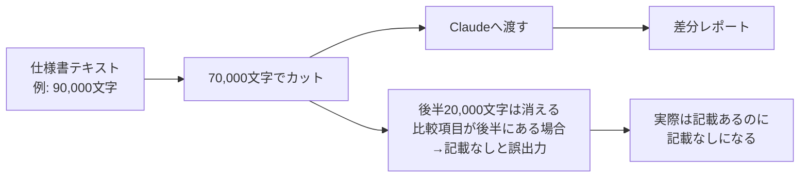

カットされたかどうかをClaudeは知らないため、`（記載なし）` と `カットによる欠落` を区別できない。

### 修正案

カット発生時にシステムプロンプトへ警告を挿入する。

```javascript
// Prepare Compare Payload ノードの修正案
const CAP_LIMIT = 70000;
const cap = (s, n) => (s || "").slice(0, n);

const new_doc_raw = newItem.new_text || "";
const cand_doc_raw = candidate.text || "";

const new_doc_truncated  = new_doc_raw.length  > CAP_LIMIT;
const cand_doc_truncated = cand_doc_raw.length > CAP_LIMIT;

const truncationWarning = [
  new_doc_truncated  ? "※ NEW DOCUMENT は文字数上限により末尾が省略されています。後半の項目が抽出できない場合は「（文字数上限により省略）」と記入してください。" : "",
  cand_doc_truncated ? "※ CANDIDATE DOCUMENT は文字数上限により末尾が省略されています。後半の項目が抽出できない場合は「（文字数上限により省略）」と記入してください。" : "",
].filter(Boolean).join("\n");

return [{
  json: {
    ...
    new_document:       cap(new_doc_raw,  CAP_LIMIT),
    candidate_document: cap(cand_doc_raw, CAP_LIMIT),
    truncationWarning,  // Build OpenRouter Payload でシステムメッセージ末尾に付加
    new_doc_chars:  new_doc_raw.length,
    cand_doc_chars: cand_doc_raw.length,
  }
}];
```

Build OpenRouter Payload 側でシステムメッセージに付加：

```javascript
const system = `
You are a document comparison assistant.
...（既存のシステムメッセージ）...
${$json.truncationWarning ? "\n\n" + $json.truncationWarning : ""}
`.trim();
```

### 確認事項

- [ ] 実際の仕様書PDFはOCR後何文字程度になるか
- [ ] 70,000文字を超えるケースは発生しているか

---

## 問題C：候補ファイルの選定根拠が見えない

### 現状

```javascript
let candidate = arr.find(x => x?.role === "candidate");
if (!candidate && arr.length) {
  candidate = arr.sort((a, b) => (b.score ?? 0) - (a.score ?? 0))[0];
}
```

Pineconeのベクトル類似度で選ばれた候補が正しいかどうか、差分レポートを見る人間には分からない。

### 確認事項

- [ ] 現在の差分レポート（Excel）に比較元ファイル名・類似度スコアは記載されているか
- [ ] 類似度スコアが低い候補（例: 0.7未満）でも処理が走ってしまう可能性はあるか

### 修正案（Excelシートへの情報追加）

差分レポートのメタ情報シートまたはヘッダーに以下を追加することを提案。

| 項目 | 値 |
|---|---|
| 今回ファイル | `new_file.fileName` |
| 比較元ファイル | `candidate_file.fileName` |
| 類似度スコア | `candidate_file.score` |
| 実行日時 | `run_id`（タイムスタンプ） |

---

## 問題D：部署不明時のデフォルトが危険

### 現状コード（Priority Compare Items Config）

```javascript
} else {
  // safe default
  priorityItems = LISTS.dept2;
}
```

部署不明時に**設計第二部（イナートガス系）**のリストで比較が走る。設計第三部の仕様書が誤ルーティングされても気づけない。

### 修正案

エラーを投げて停止させる（または処理前に確認を求める）。

```javascript
} else {
  throw new Error(
    `Priority Compare Items Config: 部署を判定できませんでした。\n` +
    `section="${section}", compareGroup="${compareGroup}"\n` +
    `new_file.fileName="${$json.new_file?.fileName ?? "不明"}"\n` +
    `想定値: 第一部(HLP/HX/AF) / 第二部 / 第三部`
  );
}
```

> **方針確認**: 「エラー停止」か「デフォルト適用してTeamsに警告通知」か、どちらが業務上望ましいかを決定する必要がある。

---

## 問題E：before/afterの逆転を検証する手段がない

### 背景

システムプロンプトに以下の強調がある（= 過去に逆転バグが発生した証拠）。

```
IMPORTANT FIELD ASSIGNMENT RULES (must follow strictly):
- Never swap before and after. before = old, after = new.
```

`Parse JSON Result` では `before === after` の場合に `no_change` へ自動補正しているが、**逆転（before と after が入れ替わっている）を検知する処理は存在しない**。

### リスク

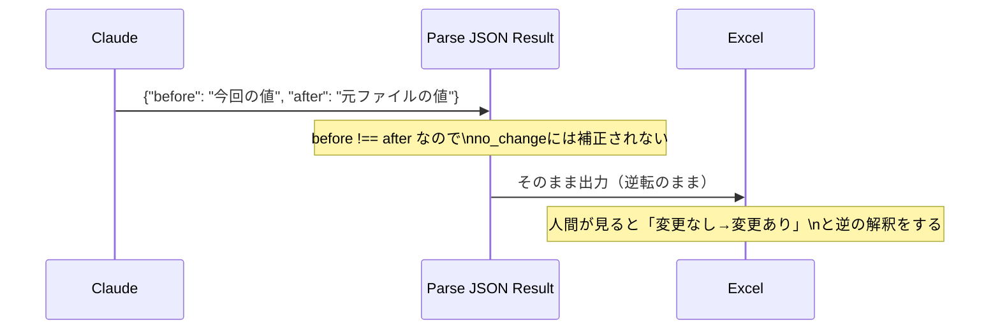

### 修正案（Parse JSON Result への追加）

「造船所」など、片方のドキュメントから確実に取れる固定フィールドで逆転を検知するのは難しい。現実的な対策として：

**① Excelレポートに before/after の由来を明記する**

現在のExcelのカラム名を確認し、`before = 元ファイル（候補）`・`after = 今回ファイル（新）` という注釈をExcelシートのヘッダーや凡例として追加する。

**② システムプロンプトでの強調をさらに明確化**

```
FIELD ASSIGNMENT — READ THIS FIRST:

  before = CANDIDATE DOCUMENT の値 = 元ファイル（比較対象）
  after  = NEW DOCUMENT の値     = 今回ファイル（今回入力）

  ⚠️ 絶対に before と after を逆にしないでください。
  確認方法: NEW DOCUMENT から抽出した値は必ず "after" に入れてください。
```

**③ ユーザープロンプトでドキュメントラベルを強調**

```javascript
const user = [
  "PRIORITY ITEMS LIST:\n",
  $json.priorityItemsText,
  "\n\n",
  "=== NEW DOCUMENT (今回ファイル / after に使う値) ===\n",
  $json.new_document,
  "\n\n",
  "=== CANDIDATE DOCUMENT (元ファイル / before に使う値) ===\n",
  $json.candidate_document,
].join("");
```

### 確認事項

- [ ] 現行バージョンで before/after の逆転は解消されているか、それとも稀に発生するか
- [ ] 人間が逆転に気づいた事例はあるか

---

## 問題F：システムプロンプトの構造問題

### 現状

プロンプト全体のおおよそのトークン数と構成：

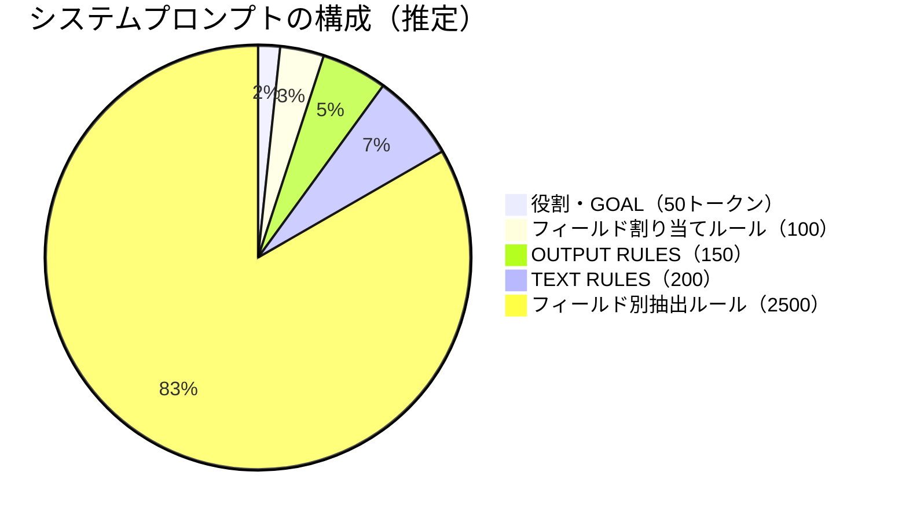

フィールド別抽出ルールが全体の約80%を占めており、LLMが後半のルールを見落とすリスクがある。

### 構造化の提案

現在のシステムプロンプトを以下の順序に再構成する。

```
# ROLE
You are a document comparison assistant.

# CRITICAL RULES（最優先・短く・太字相当）
1. before = CANDIDATE DOCUMENT の値（元ファイル）
2. after  = NEW DOCUMENT の値（今回ファイル）
3. Return ONLY raw JSON — no markdown, no explanation
4. Output ALL priority items (even if no_change)

# OUTPUT FORMAT
（json_schemaの説明）

# FIELD EXTRACTION RULES
（フィールド別ルール — 変更なし）
```

> **重要**: LLMは長いプロンプトの**先頭と末尾**を最もよく参照する。現在「before/after逆転禁止」がプロンプトの途中に埋まっているため、先頭の `CRITICAL RULES` セクションに移動させる。

### 確認事項

- [ ] フィールド別ルールのうち、実際に効いているものと効いていないものを把握しているか
- [ ] 特に精度が悪いフィールドはどれか

---

## 問題G：欠損セクションで全ワークフロー停止

### 現状コード（Parse JSON Result）

```javascript
const missing = priorityItems.filter(s => !seen.has(s));
if (missing.length) {
  throw new Error("Model output is missing priority sections: " + missing.join(", "));
}
```

1つでも欠落するとExcelすら出力されず、Teams通知も止まる。

### 方針の選択肢

| 選択肢 | メリット | デメリット |
|---|---|---|
| **現行：エラー停止** | 不完全な結果を出さない | 業務が完全にブロックされる |
| **部分出力＋警告** | 業務継続できる。不完全な箇所が分かる | 担当者が欠落を見落とすリスク |
| **リトライ後に停止** | 一時的なモデル応答ブレを吸収できる | 複雑化・コスト増 |

### 修正案（部分出力＋Teamsへ警告）

```javascript
if (missing.length) {
  // エラーで止めず、欠損を記録して処理継続
  const missingEntries = missing.map(s => ({
    type: "extraction_failed",
    section: s,
    before: "（抽出失敗）",
    after: "（抽出失敗）",
    note: "モデルがこの項目を出力しませんでした",
  }));
  dedupedBySection.push(...missingEntries);

  // Teamsへ警告（別途ノードで送信）
  $output.meta = {
    hasMissingFields: true,
    missingFields: missing,
  };
}
```

> **方針確認**: ビジネス的に「欠損があっても他の項目だけでも出力してほしい」か「不完全な結果は出さない方がよい」かを決定する必要がある。

---

## 問題H：精度を測る仕組みがない

### 現状

| 確認手段 | 有無 |
|---|---|
| 自動テスト | なし |
| ゴールドセット（正解データ） | なし（推定） |
| フィールド別精度計測 | なし |
| 人間レビューの記録 | 不明 |

### 提案：ゴールドセット作成

最低10〜20件の「正解付き差分」を作成し、プロンプト変更前後で比較できるようにする。


### 評価指標案

| 指標 | 内容 |
|---|---|
| フィールド単位正答率 | 各比較項目の before/after が正解と一致する割合 |
| 変更/非変更の分類精度 | `modification` vs `no_change` の正解率 |
| before/after逆転率 | 全抽出件数中で逆転が起きた割合 |

### 確認事項

- [ ] 過去の出力で人間が確認・承認したものが残っているか
- [ ] ゴールドセット作成を誰が・いつやるか

---

## 修正の優先順位まとめ

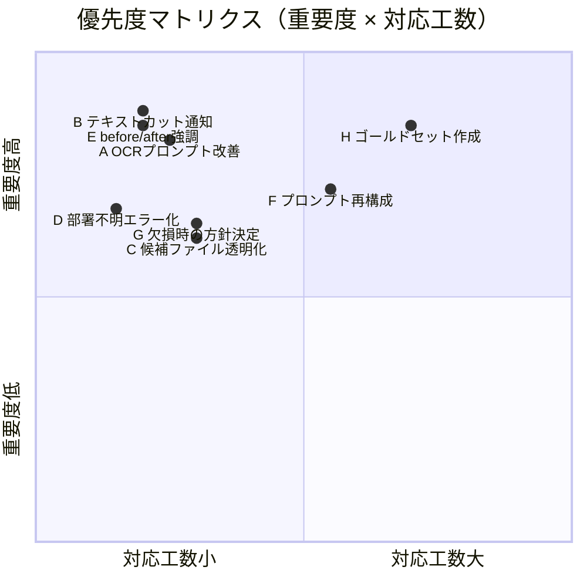

### 今すぐできる修正（工数小・効果大）

| # | 修正内容 | 変更場所 | 工数目安 |
|---|---|---|---|
| 1 | OCRプロンプトに表・ヘッダー指示を追加 | OCR API Call ノード | 30分 |
| 2 | ユーザープロンプトで NEW/CANDIDATE のラベルを強調 | Build OpenRouter Payload | 15分 |
| 3 | テキストカット時の警告をシステムメッセージに追加 | Prepare Compare Payload + Build OpenRouter Payload | 1時間 |
| 4 | 部署不明時にエラー停止（デフォルトdept2を廃止） | Priority Compare Items Config | 15分 |
| 5 | システムプロンプトの冒頭に CRITICAL RULES セクション追加 | Build OpenRouter Payload | 30分 |

### 議論が必要な修正

| # | 修正内容 | 必要な意思決定 |
|---|---|---|
| G | 欠損セクション時の挙動 | エラー停止 vs 部分出力、業務判断が必要 |
| H | ゴールドセット作成 | 誰が・何件・いつまでに |
| C | 候補ファイル選定の閾値 | スコア何点以下は弾くか |

---

## レビュー会アジェンダ案（90分）

| 時間 | 内容 | 担当 |
|---|---|---|
| 0〜15分 | OCR出力テキストの目視確認（問題A） | 全員 |
| 15〜30分 | 候補ファイル選定の精度確認（問題C） | 全員 |
| 30〜45分 | before/after逆転の発生状況確認（問題E） | 全員 |
| 45〜60分 | 欠損セクション時の業務方針決定（問題G） | 意思決定者 |
| 60〜75分 | 今すぐできる修正5件の実施可否確認 | 開発担当 |
| 75〜90分 | ゴールドセット作成計画（問題H） | 全員 |

## 事前に用意すると効果的な資料

- [ ] 実際のOCR出力テキスト（PDF原本と並べて確認できる形）
- [ ] 過去の差分レポートExcel（正解が分かっているもの）
- [ ] 比較候補ファイルの類似度スコア分布（Pineconeのログ）
- [ ] エラーログ（欠損セクションエラーの発生件数・頻度）

---

## AI呼び出しのパターン分析

現在のAgent 2にはAI呼び出しが4種類あるが、**役割・難度・改善方針がそれぞれ異なる**。パターンを整理することで、どこにリソースを集中すべきかが明確になる。

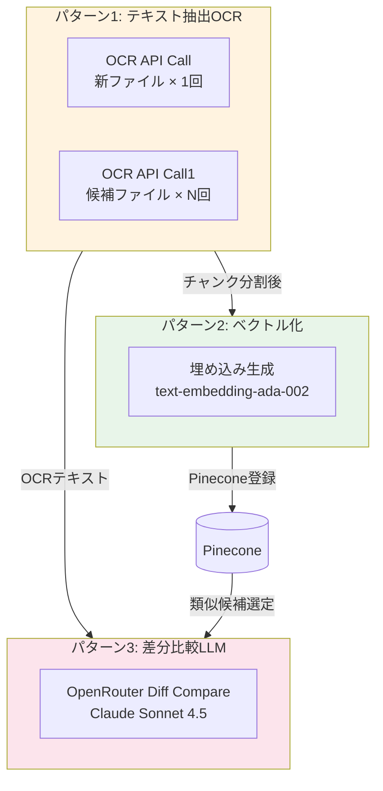

---

### パターン1：テキスト抽出OCR（OCR API Call / OCR API Call1）

#### 問題①：同一コードが2ノードに重複している

`OCR API Call`（新ファイル用）と `OCR API Call1`（候補ファイル用）は**完全に同一のリクエスト構造**を持つ。

| 項目 | OCR API Call | OCR API Call1 |
|---|---|---|
| モデル | openai/gpt-4.1-mini | openai/gpt-4.1-mini |
| プロンプト | 同じ | 同じ |
| プラグイン | mistral-ocr | mistral-ocr |
| 用途 | 新ファイル（1回） | 候補ファイル（ループ × N回） |

プロンプトを修正する際に**2箇所を同時に変更しなければならない**。片方だけ直して不整合が起きるリスクがある。

**修正案**: n8nのサブワークフローまたは共通ノードとして1箇所に集約し、入力だけ切り替える。

---

#### 問題②：候補ファイルをOCRし直しているが、Pineconeに既にある

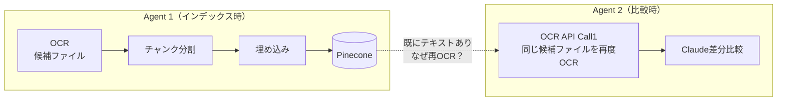

Agent 1でインデックス済みの候補ファイルを、Agent 2でも毎回OCRし直している。

- **コスト**: 候補ファイルが多いほどOCR API呼び出しが増える
- **速度**: ループ処理の遅延原因
- **精度の揺れ**: 同じPDFでも OCR結果がわずかに変わる可能性

**確認事項**: Pineconeにはテキストチャンクが保存されているはず。チャンクを全件取得して結合すれば、再OCRは不要にできるか？

---

#### 問題③：OCRの用途が実は2種類ある（目的が違う）

| 用途 | 必要な品質 | 現在の対応 |
|---|---|---|
| **Pineconeインデックス用**（Agent 1） | チャンク単位で意味が通じれば良い。多少崩れても埋め込みには耐える | 最小プロンプト |
| **Claude差分比較用**（Agent 2） | 表の列・数値・単位が正確に保持される必要がある | 同じ最小プロンプト ← **問題** |

差分比較用OCRには、表構造・数値精度の要件が厳しい。インデックス用と**プロンプトを分けるべき**。

---

### パターン2：ベクトル化（埋め込み生成）

#### 問題：OCR品質がPinecone検索精度に直結する

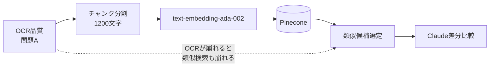

OCRで表が崩れた状態でチャンク化・ベクトル化されると、**類似検索の精度も下がる**。
問題Aで提案したOCRプロンプト改善は、差分比較だけでなくPinecone検索精度にも効く。

#### 確認事項

- [ ] チャンクサイズ 1,200文字は船舶仕様書のセクション単位に合っているか（長すぎ/短すぎ問題）
- [ ] Pineconeのnamespace設計は部署・機器カテゴリ別に分かれているか

---

### パターン3：差分比較LLM（OpenRouter Diff Compare）

現在の差分比較は「全部署のルールを含む1つのシステムプロンプト」で動いているが、フィールドの性質によって**抽出の難しさが大きく異なる**。精度改善のためにはフィールドをタイプ別に分類して対策を絞る必要がある。

#### フィールドの難度分類

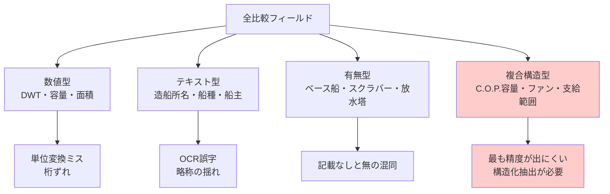

| タイプ | 代表フィールド | 主なリスク | 優先度 |
|---|---|---|---|
| **数値型** | DWT、C.O.P.容量、ファンモータkW | 単位変換ミス・桁ずれ・抽出範囲の誤り | 🟡 中 |
| **テキスト型** | 造船所、船種、船主、船籍 | OCR誤字、略称と正式名の揺れ | 🟢 低 |
| **有無型** | ベース船の有無、放水塔の有無 | 「記載なし」と「無」の混同 | 🟡 中 |
| **複合構造型** | C.O.P.容量、ファン容量＋台数、支給範囲 | 複数の数値・属性を1フィールドで抽出 → **最も精度低下しやすい** | 🔴 高 |

---

#### 複合構造型フィールドへの対策案

複合構造型は「1つのフィールドに数値・単位・数量・型番が混在」するため、現在のような自由形式テキスト抽出では安定しない。

**現状の指示例（C.O.P.容量）:**
```
- 「C.O.P.容量」refers to the Cargo Oil Pump capacity.
  Extract the full value including flow rate, head, and quantity,
  e.g. "5,500 m³/h x 145 m  3 sets"
```

**問題**: 出力形式が毎回異なる可能性がある（「3 sets」「3台」「×3」など）

**改善案**: 複合構造型フィールドのみ、出力フォーマットを明示的に指定する。

```
- 「C.O.P.容量」: Extract in this exact format:
  "{flow_rate} m³/h x {head} m, {qty} sets"
  Example: "5,500 m³/h x 145 m, 3 sets"
  If any element is missing, write "（記載なし）" for that element only.
```

---

#### 部署別システムプロンプトの分離案

現在は全部署（設計第一部HLP/HX/AF・第二部・第三部）のフィールドルールが**1つのシステムプロンプトに混在**している。

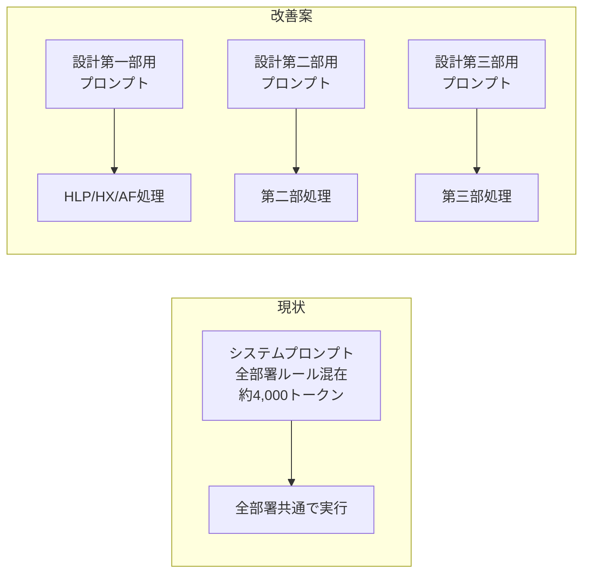

**分離のメリット:**

| 観点 | 現状 | 分離後 |
|---|---|---|
| プロンプト長 | 全部署ルール混在で約4,000トークン | 各部署約1,000〜1,500トークンに削減 |
| 適用ルールの精度 | 関係ない部署のルールもロードされる | その部署に関係するルールだけが有効 |
| 保守性 | 1ファイル変更で全部署に影響 | 部署ごとに独立して修正可能 |

**デメリット:** `Build OpenRouter Payload` ノードを部署ごとに分岐させる必要があり、ノード数が増える。

**現実的な折衷案**: ノードは1つのまま、`system` 変数を部署ごとに切り替える形にする。

```javascript
// Build OpenRouter Payload の改善案（概念）
const SYSTEM_PROMPTS = {
  dept1_HLP: `...HLP専用ルール（~1,200トークン）...`,
  dept1_HX:  `...HX専用ルール（~1,200トークン）...`,
  dept1_AF:  `...AF専用ルール（~1,200トークン）...`,
  dept2:     `...第二部専用ルール（~1,500トークン）...`,
  dept3:     `...第三部専用ルール（~800トークン）...`,
};

const deptKey = /* Priority Compare Items Config からキーを引き継ぐ */;
const system = COMMON_RULES + "\n\n" + SYSTEM_PROMPTS[deptKey];
```

共通ルール（役割定義・before/after規則・OUTPUT RULES）は全部署で共通化し、フィールド別抽出ルールだけを差し替える構造にする。

---

### パターンまとめ：改善の優先順位

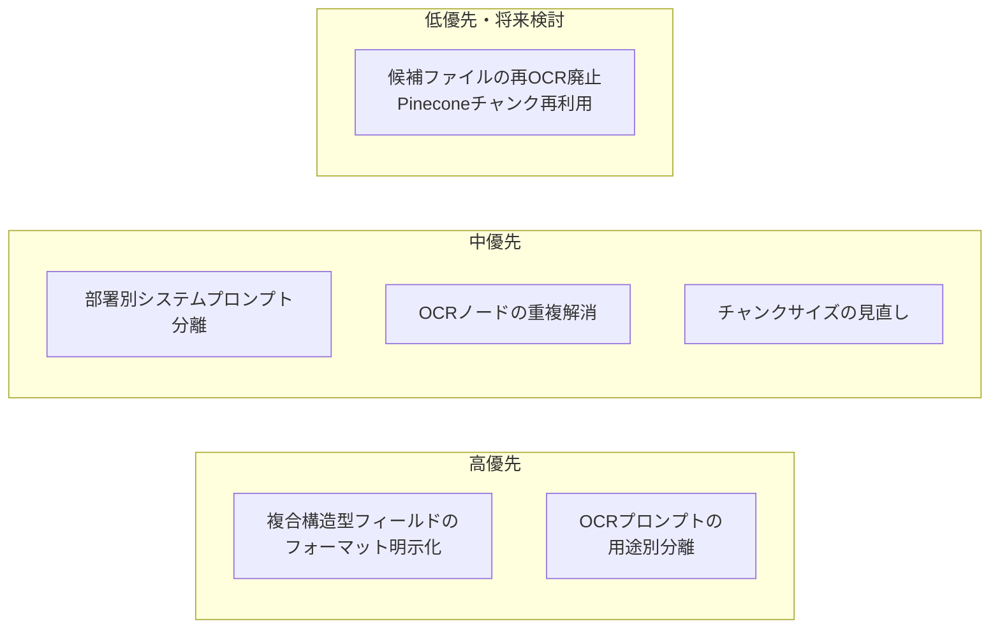

| # | パターン | 改善内容 | 期待効果 |
|---|---|---|---|
| P-1 | OCR重複 | 2ノードを1つに集約 | 保守性向上（プロンプト変更が1箇所で済む） |
| P-2 | OCR用途別 | 比較用OCRのプロンプトを強化 | 表崩れ・数値誤りの減少 |
| P-3 | 複合構造型 | フォーマット明示指定 | C.O.P.容量・ファン等の抽出安定化 |
| P-4 | 部署別プロンプト | システムプロンプトを部署ごとに分割 | プロンプト長の削減・ルール適用精度向上 |
| P-5 | 再OCR廃止 | Pineconeチャンク結合で代替 | API呼び出し削減・速度改善 |
