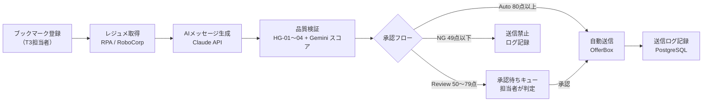
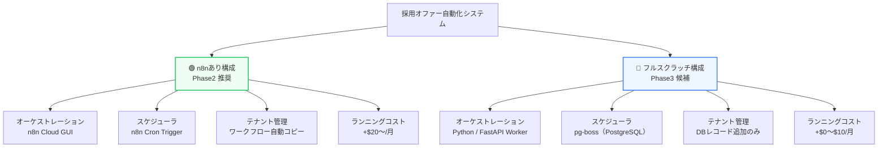
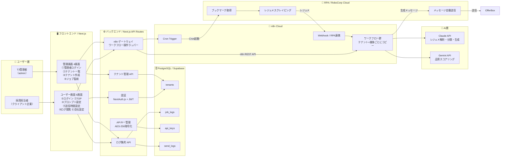
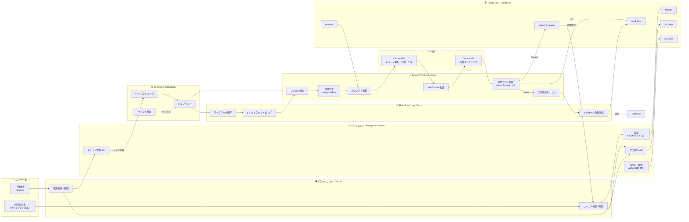
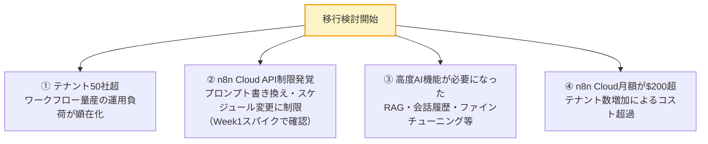
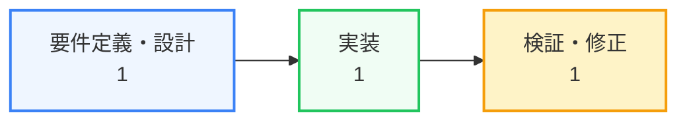
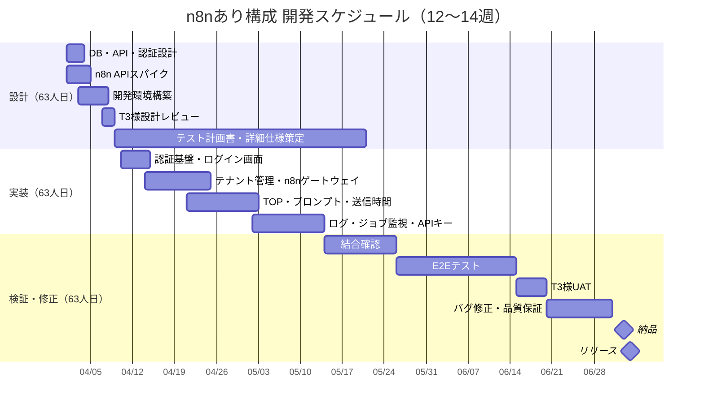
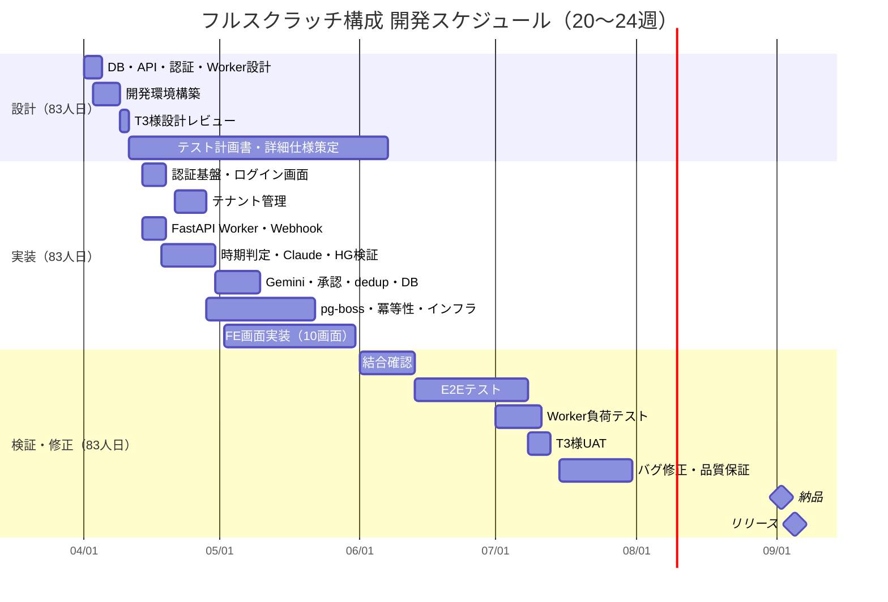

# T3 Recruit Automation  
## 開発見積 概要資料

**宛先：** T3株式会社 御中  
**発行：** 株式会社homula  
**発行日：** 2026年3月

---

## 1. システム概要

OfferBoxから候補者レジュメを自動取得し、AIによるパーソナライズメッセージを生成・品質検証のうえ自動送信する採用オファー自動化システムの開発見積です。

本資料では **n8nあり構成（Phase2推奨）** と **フルスクラッチ構成（Phase3候補）** の2案を提示します。

---

## 2. 処理フロー概要

---

## 3. 共通スタック

ユーザー画面・管理画面・DB・AI・RPA層は **両構成で共通**。変わるのはオーケストレーション層のみ。

### 3-1. フロントエンド

| カテゴリ | 技術 | 備考 |
|---------|------|------|
| フレームワーク | Next.js 14（App Router） | SSR対応。日本エンジニア採用市場で主流 |
| 言語 | TypeScript | 型安全性確保。バグ早期検出 |
| スタイリング | Tailwind CSS | デザイントークンと整合 |
| コンポーネント | shadcn/ui | アクセシビリティ対応済み |
| 状態管理 | React Query（TanStack Query） | サーバー状態のキャッシュ・再フェッチ管理 |
| フォーム | React Hook Form + Zod | 入力バリデーション |
| デプロイ | Vercel | Next.jsとの親和性が高い。Preview環境が自動生成 |

### 3-2. バックエンド

| カテゴリ | 技術 | 備考 |
|---------|------|------|
| APIフレームワーク | Next.js API Routes | フロントと同一リポジトリで完結 |
| 認証 | NextAuth.js v5（Auth.js） | メール+PW認証。JWT。ユーザー/管理者ロール分離 |
| ORM | Prisma | PostgreSQLとのDB操作。マイグレーション管理 |
| バリデーション | Zod | APIリクエストのスキーマ検証 |
| 暗号化 | Node.js crypto（AES-256-GCM） | APIキーの暗号化保存 |
| メール送信 | Resend | パスワードリセットメール送信 |

### 3-3. データベース

| カテゴリ | 技術 | 備考 |
|---------|------|------|
| DB本体 | PostgreSQL | テナント管理・ジョブログ・送信ログ・APIキー保管 |
| ホスティング | Supabase | RLS（Row Level Security）でマルチテナント分離 |
| マイグレーション | Prisma Migrate | スキーマ変更の履歴管理 |

### 3-4. AI層

| カテゴリ | 技術 | 備考 |
|---------|------|------|
| メッセージ生成LLM | Claude API（claude-sonnet-4-5） | レジュメ解析・候補者分類・メッセージ生成（統合処理） |
| 品質スコアリングLLM | Gemini API（Gemini 2.0 Flash） | 生成メッセージの安全性を0〜100点で評価 |
| コスト最適化 | Prompt Caching（Claude） | システムプロンプトをキャッシュし入力トークンコストを削減 |

### 3-5. RPA層

| カテゴリ | 技術 | 備考 |
|---------|------|------|
| RPAフレームワーク | RoboCorp Cloud | OfferBoxへのログイン・レジュメ取得・メッセージ送信 |
| ブラウザ操作 | Selenium 4 / Playwright | 採用媒体のUI操作 |
| BAN対策 | プロキシローテーション | IPアドレス切り替えによるアクセス制限回避 |
| 待機制御 | ランダム待機（3〜7秒） | 送信間隔の揺らぎで不自然なアクセスを回避 |

### 3-6. インフラ・運用共通

| カテゴリ | 技術 | 備考 |
|---------|------|------|
| エラー通知 | Slack Webhook | Failed連続3件・LLMエラー率超過時の即時通知 |
| ログ監視 | Vercel Logs / Supabase Logs | APIエラー・クエリパフォーマンス監視 |
| シークレット管理 | Vercel Environment Variables | APIキー・DB接続文字列の安全な管理 |
| CI/CD | GitHub Actions + Vercel | PRマージで自動デプロイ |

---

## 4. 構成比較

---

## 5. アーキテクチャ図

### 5-1. n8nあり構成

### 5-2. フルスクラッチ構成

---

## 6. オーケストレーション層の比較

| 観点 | n8nあり ✅ | フルスクラッチ |
|------|-----------|--------------|
| 開発工数 | ベースライン | +29〜30人日 |
| テナント追加 | ワークフローコピー（API自動化で解決可能） | DBレコード追加のみ（ゼロ工数） |
| 処理ロジックの可視性 | GUIで視覚的に確認可能 | コードで完結。テスト・レビューが容易 |
| デバッグ | n8n実行ログで確認 | 通常のログ・トレースで確認 |
| ベンダーロック | 高い（n8n固有JSON構造に依存） | なし（標準Python/SQLのみ） |
| スケーラビリティ | テナント100社超でワークフロー量産が課題 | DBスケールのみで対応 |
| 月額コスト差分 | +$20〜/月（n8n Cloud） | +$0〜$10/月（Workerホスティングのみ） |
| 推奨タイミング | 現時点（Phase1〜2初期） | テナント50社超 or n8n API制限発覚時 |

### フルスクラッチへの移行トリガー

---

## 7. 工数配分方針

本見積は **要件定義・設計 ： 実装 ： 検証・修正 ＝ 1 ： 1 ： 1** の原則に基づいて工数を配分しています。

設計と実装を同等の工数で行うことで仕様の網羅性・品質を担保し、検証・修正フェーズも同等の工数を確保することで手戻りリスクを最小化します。

---

## 8. 単価前提

| 役割 | 時間単価（税抜） | 対象タスク |
|------|---------------|-----------|
| PM | 12,500円/h | スケジュール管理・リスク管理・社内調整・進捗報告 |
| ディレクション | 12,500円/h | 定例会議・議事録・T3様窓口・仕様調整 |
| コンサル | 15,000円/h | 要件定義・設計・テスト計画書作成・スパイク |
| エンジニア | 12,500円/h | 実装・結合確認・内部テスト・バグ修正 |
| アシスタント | 5,000円/h | テストケース作成補助・UAT補助・マニュアル作成 |

> ※ 1人日 = 8時間  
> ※ 別途消費税10%が加算されます

---

## 9. 費用見積

### 9-1. n8nあり構成（Phase2）

**体制：** 2名（フルスタックエンジニア + フロントエンドエンジニア）  
**期間：** 12〜14週間

**工数配分（設計 : 実装 : 検証 ＝ 63 : 63 : 63 人日）**

| フェーズ | 人日 | 時間 | 主な内容 |
|---------|------|------|---------|
| 設計（コンサル） | 63人日 | 504h | DB・API・認証設計、n8nスパイク、テスト計画書・詳細仕様書・受入基準の策定 |
| 実装（エンジニア） | 63人日 | 504h | バックエンド実装25日 ＋ フロントエンド10画面38日 |
| 検証・修正（エンジニア） | 63人日 | 504h | 結合確認12日 ＋ E2Eテスト20日 ＋ UAT対応・バグ修正31日 |
| **比率** | **1 : 1 : 1** | | |

**費用明細**

| 役割 | 時間単価 | 工数（人日） | 工数（時間） | 費用（税抜） |
|------|---------|------------|------------|------------|
| PM | 12,500円 | 5人日 | 40h | 500,000円 |
| ディレクション | 12,500円 | 9人日 | 72h | 900,000円 |
| コンサル | 15,000円 | 63人日 | 504h | 7,560,000円 |
| エンジニア | 12,500円 | 126人日 | 1,008h | 12,600,000円 |
| アシスタント | 5,000円 | 6人日 | 48h | 240,000円 |
| **小計** | | **209人日** | **1,672h** | **21,800,000円** |
| 消費税（10%） | | | | 2,180,000円 |
| **合計（税込）** | | **209人日** | **1,672h** | **23,980,000円** |

---

### 9-2. フルスクラッチ構成（Phase3）

**体制：** 3名（フルスタックエンジニア + Pythonエンジニア + フロントエンドエンジニア）  
**期間：** 20〜24週間

**工数配分（設計 : 実装 : 検証 ＝ 83 : 83 : 83 人日）**

| フェーズ | 人日 | 時間 | 主な内容 |
|---------|------|------|---------|
| 設計（コンサル） | 83人日 | 664h | DB・API・認証・Workerアーキテクチャ・冪等性・並列制御設計、テスト計画書・詳細仕様書・受入基準の策定 |
| 実装（エンジニア） | 83人日 | 664h | バックエンド14日 ＋ FE30日 ＋ Worker21日 ＋ pg-boss8日 ＋ 冪等性7日 ＋ インフラ3日 |
| 検証・修正（エンジニア） | 83人日 | 664h | 結合確認12日 ＋ E2Eテスト25日 ＋ Worker検証20日 ＋ UAT対応・バグ修正26日 |
| **比率** | **1 : 1 : 1** | | |

**費用明細**

| 役割 | 時間単価 | 工数（人日） | 工数（時間） | 費用（税抜） |
|------|---------|------------|------------|------------|
| PM | 12,500円 | 7人日 | 56h | 700,000円 |
| ディレクション | 12,500円 | 14人日 | 112h | 1,400,000円 |
| コンサル | 15,000円 | 83人日 | 664h | 9,960,000円 |
| エンジニア | 12,500円 | 166人日 | 1,328h | 16,600,000円 |
| アシスタント | 5,000円 | 8人日 | 64h | 320,000円 |
| **小計** | | **278人日** | **2,224h** | **28,980,000円** |
| 消費税（10%） | | | | 2,898,000円 |
| **合計（税込）** | | **278人日** | **2,224h** | **31,878,000円** |

---

## 10. 比較サマリー

```mermaid
xychart-beta
    title "役割別費用比較（税抜・万円）"
    x-axis ["PM", "ディレクション", "コンサル", "エンジニア", "アシスタント"]
    y-axis "費用（万円）" 0 --> 1700
    bar [50, 90, 756, 1260, 24]
    bar [70, 140, 996, 1660, 32]
```

| | n8nあり（Phase2） | フルスクラッチ（Phase3） |
|---|---|---|
| **合計工数** | 209人日 / 1,672h | 278人日 / 2,224h |
| **合計費用（税抜）** | **21,800,000円** | **28,980,000円** |
| **合計費用（税込）** | **23,980,000円** | **31,878,000円** |
| 費用差額（税抜） | ─ | +7,180,000円 |
| 設計 : 実装 : 検証 | 63 : 63 : 63（1:1:1） | 83 : 83 : 83（1:1:1） |
| 開発期間 | 12〜14週間 | 20〜24週間 |
| 必要エンジニア | 2名（FS + FE） | 3名（FS + PY + FE） |

---

## 11. スケジュール概要

### 11-1. n8nあり構成

### 11-2. フルスクラッチ構成

---

*以上*  
*株式会社homula*
